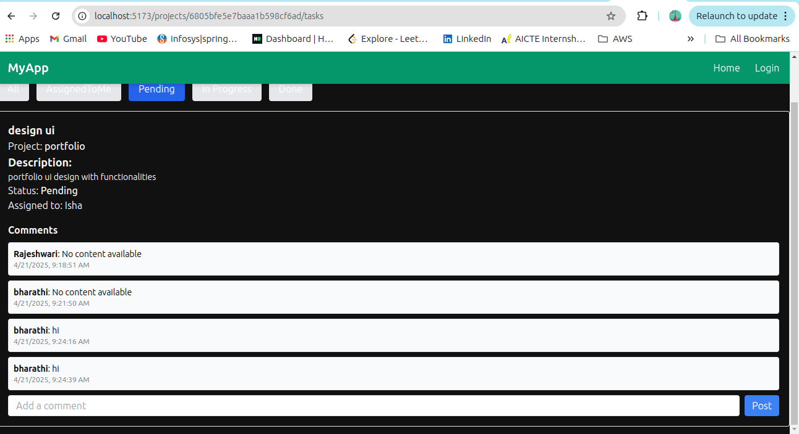

# Project and Task Managemnet frontend 
## Home

# User Registrartion Page

## Login page

## Admin Page 

## create Project 

## create Task 

## All users Data 

## User page (nav bar content differs  from admin reusable component navbar)

## view assigned tasks and update ststua of tasks with single click

## tasks of the project filters comments 

## comments section for tasks 

## Responsive 

